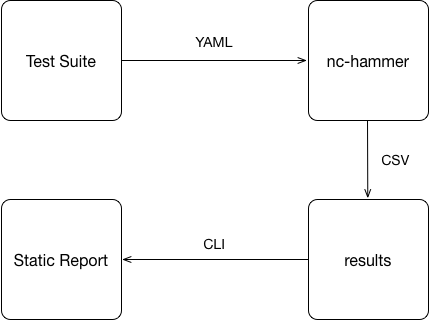

# NETCONF Load Tool

[](https://travis-ci.org/damianoneill/nc-hammer)
[](https://github.com/damianoneill/nc-hammer/releases)
[](http://goreportcard.com/report/damianoneill/nc-hammer)
[](https://github.com/damianoneill/nc-hammer/blob/master/LICENSE)
[](https://coveralls.io/github/damianoneill/nc-hammer?branch=master)

If you don't have a Go evnironment setup, you can __download a binary__ from the [releases](https://github.com/damianoneill/nc-hammer/releases) page, I suggest you place this somewhere in an existing bin path.

The tool uses a YAML file to define the test suite.  A sample [Test Suite](./suite/testdata/testsuite.yml) is included in the repository.  Running a scenario generates a results directory containing a copy of the testsuite definition and its results encoded in CSV format.  The tool can then be used to generate reports against the contents within the results directory.



## Test Suite

A Test Suite is a YAML document that is used to feed nc-hammer.  It is made up of three sections; Suite Configuration, Host Configuration and a section that contains the sequences of Actions (primarily netconf requests) to be executed.

__YAML is sensitive to indentation__, if your not familiar with YAML see [here](https://learnxinyminutes.com/docs/yaml/).

### Suite Configuration

The suite configuration defines the top-level setup for a Test Suite, this includes configuration options for;

* The number of iterations that the block section should be repeated for
* The number of concurrent clients that should connect to each Host
* A rampup time for the client connections

These permutations allow you to do both functional (iterations:1 and concurrent:1) and load (concurrent:n, where n>1) testing.

### Host Configuration

The host configuration defines the parameters required to make a SSH connection to a Device.  This includes;

* hostname (dns or ip name)
* port (for netconf agents running on a nonstandard port)
* username (netconf username)
* password (netconf password)
* reuseconnection (indicates whether a ssh connection against a device should be reused or restablished each time a request is sent)

```yaml
- hostname: 10.0.0.1      # ip address or dns hostname
  port: 830               # netconf port
  username: username
  password: password
  reuseconnection: true  # defaults to false
```

Within the Test Suite you can define as many hosts as you require, see the sample [Test Suite](./suite/testdata/testsuite.yml) for examples of this.  Then when you use the host in an action later, you use the hostname as the identifier for the host configuration defined in this section to be used.

### Blocks Configuration

The blocks' configuration contains the defintion of the sequence of requests (an action) that should be executed against your SUT.  The blocks section contains a list of block definitions, __the list is executed sequentially per client__.  Each block section defines the type of block it is, options include; init, sequential or concurrent.  The blocks themselves contain a list of actions, currently two action types are supported; netconf and sleep.

A sleep Action is a pause in the execution of a block.  The sleep action defines a duration in Milliseconds.

A netconf Action is a definition for a NETCONF operation or a NETCONF Message.  The NETCONF operations that are supported are [get](https://tools.ietf.org/html/rfc6241#page-48), [get-config](https://tools.ietf.org/html/rfc6241#page-35) and [edit-config](https://tools.ietf.org/html/rfc6241#page-37).  The parameters that are available for each netconf action reflect the parameters defined in the [NETCONF Specification](https://tools.ietf.org/html/rfc6241).  

For e.g. the NETCONF RPC message containing an edit-config operation

```xml
<rpc xmlns="urn:ietf:params:xml:ns:netconf:base:1.0" message-id="101">
   <edit-config>
      <target>
         <running />
      </target>
      <config>
         <top xmlns="http://example.com/schema/1.2/config">
            <interface>
               <name>Ethernet0/0</name>
               <mtu>1500</mtu>
            </interface>
         </top>
      </config>
   </edit-config>
</rpc>
```

maps to the following yaml definition in a testsuite for an operation

```yaml
- netconf:
    hostname: 10.0.0.1
    operation: edit-config
    target: running
    config: <top xmlns="http://example.com/schema/1.2/config"><protocols><ospf><area><name>0.0.0.0</name><interfaces><interface
      xc:operation="delete"><name>192.0.2.4</name></interface></interfaces></area></ospf></protocols></top>
```

Note that the config yaml tag contains the contents of the xml contained with the <config/> element within the rpc element

To reduce the verbosity of test suites the config attribute in the YAML file can be overriden to refer to an external XML file that should have its contents inlined using the __file:__ identifier.  For e.g. an XML file such as

```sh
$ cat edit-config.xml
<top xmlns="http://example.com/schema/1.2/config"><protocols><ospf><area><name>0.0.0.0</name><interfaces><interface operation="delete"><name>192.0.2.4</name></interface></interfaces></area></ospf></protocols></top>
```

can be referenced in the YAML as

```yaml
- netconf:
    hostname: 10.0.0.2
    operation: edit-config
    target: running
    config: file:edit-config.xml
```

When running the testsuite the content in the XML file will be inlined as if it had been defined as:

```yaml
- netconf:
    hostname: 10.0.0.2
    operation: edit-config
    target: running
    config: <top xmlns="http://example.com/schema/1.2/config"><protocols><ospf><area><name>0.0.0.0</name><interfaces><interface
      xc:operation="delete"><name>192.0.2.4</name></interface></interfaces></area></ospf></protocols></top>
```

Support for the Message layer in NETCONF is included to enable proprietary operations.  For e.g. a NETCONF propertiary RPC can be defined as follows:

```yaml
- netconf:
    hostname: 10.0.0.1
    message: rpc
    method: <some-method><do-stuff/></some-method>
```

Like the edit-operation config tag the method tag above can use the __file:__ identifier to include a snippet of xml to help with the verbosity of the test-suite.

```yaml
- netconf:
    hostname: 10.0.0.1
    message: rpc
    method: file:subscribe-method.xml
```

A simple response validator is included with the netconf action definition.  This uses [Regex](https://en.wikipedia.org/wiki/Regular_expression) to pattern match on the response payload for a netconf rpc.  The YAML field itself is optional, if populated the regex pattern will be matched against the rpcReply and if unsuccessful will generate an error.  An example of a netconf action defined using the expected response follows:

```yaml
  - netconf:
      hostname: 10.0.0.2
      operation: get
      filter:
        type: subtree
        select: <users/>
      expected: "(<[^>]+>)"
```

For user unfamiliar with regex pattern matching, online tools such as [txt2re](https://txt2re.com) can really help.

*NOTE* in the above example that the regex pattern must be wrapped in inverted commas.

#### Init

An init block is used to initialise the SUT, this is optional and is not required to execute a test suite.  If more than one init block is defined, the first one in the list is used.  The init block is executed once (regardless of number of clients or number of iterations), on suite startup before any other block is executed.

#### Sequential

A sequential block is a set of actions that are executed sequentially.  An assumption can be made with regard to ordering in this block type.

#### Concurrent

A concurrent block contains a set of actions that are executed concurrently.  No assumption should be made with regard to ordering in this block type.

### Handling XML

Some NETCONF Actions require defining snippets of XML for e.g. in the edit-config operation, any XML included in TestSuite should be minified, this can be simplified by using an [online minifier](http://www.webtoolkitonline.com/xml-minifier.html).

For e.g. 

```
<top xmlns="http://example.com/schema/1.2/config">
   <interface>
      <name>Ethernet0/0</name>
      <mtu>1500</mtu>
   </interface>
</top>
```

would become

```
<top xmlns="http://example.com/schema/1.2/config"><interface><name>Ethernet0/0</name><mtu>1500</mtu></interface></top>
```

## Usage

```sh
$ nc-hammer
A NETCONF Load Tester

Usage:
  nc-hammer [command]

Available Commands:
  analyse     Analyse the output of a Test Suite run
  completion  Generate shell completion script for nc-hammer
  help        Help about any command
  init        Scaffold a TestSuite and snippets directory
  run         Execute a Test Suite
  version     Show nc-hammer version

Flags:
      --config string   config file (default is $HOME/../nc-hammer.yaml)
  -h, --help            help for nc-hammer

Use "nc-hammer [command] --help" for more information about a command.
```

## Example Usage

To simplify the process of getting up and running, the application includes a scaffolding function.  

```sh
nc-hammer init scenario1
```

This will generate a folder called scenario1 that includes a sample TestSuite and an example XML Snippet.

```sh
$ tree scenario1
scenario1
├── snippets
│   └── edit-config.xml
└── test-suite.yml
```

A Test Suite run can be executed as follows, note that as the suite runs, it will write a '.' to the screen to indicate a succesful NETCONF Request and a 'E' to indicate an Error.

```sh
$ nc-hammer run test-suite.yml
Testsuite /Users/doneill/scenario1/test-suite.yml started at Tue Jun 19 10:55:33 2018
 > 5 client(s) started, 10 iterations per client, 0 seconds wait between starting each client
.................E................E...............
Testsuite completed in 22.369465719s
```

After completion of a testsuite, an output folder with the date timestamp will be created in a folder called results.  
This folder contains a csv file summarizing the test run and a copy of the test suite used in the run for archive purposes.

```sh
$ ls results
2018-06-19-10:55:55
```

You can analyse the results as follows:

```sh
$ nc-hammer analyse results/2018-06-19-10:55:55/

Testsuite executed at 2018-06-19-10:55:55
Suite defined the following hosts: [172.26.138.50 172.26.138.57 172.26.138.118 172.26.138.53 172.26.138.46]
5 client(s) started, 10 iterations per client, 0 seconds wait between starting each client

Total execution time: 22.368s, Suite execution contained 2 errors


 HOST           OPERATION   REUSE CONNECTION  REQUESTS  MEAN     VARIANCE   STD DEVIATION

 172.26.138.50  get-config  false                   48  2185.17  297421.42         545.36

```

As you can see the default analyse option generates the __mean__ (the total of the latencies divided by how many latencies there are), __variance__ (measures how far each latency in the set is from the mean) and __standard devitation__ (is a measure of the extent to which the latency set varies from the mean) for the set of latencies associated with a specific operation against a specific host.

If the results included errors (the latencies for these are excluded from the set of results), you can analyse the errors as follows:

```sh
$ nc-hammer analyse error results/2018-06-19-10:55:55/

Testsuite executed at 2018-06-19-10:55:55
Total Number of Errors for suite: 2

 HOSTNAME       OPERATION   ERROR

 172.26.138.50  get-config  ssh: handshake failed: ssh: unable to authenticate, attempted methods [none
                            password], no supported methods remain

 172.26.138.50  get-config  ssh: handshake failed: ssh: unable to authenticate, attempted methods [none
                            password], no supported methods remain
```

*Tip* Groups of requests for specific flows can be simulated and tracked. For example to do this:
In your local machines hosts file (for e.g. /etc/hosts) add hostnames identifying the various groups of requests you want to identify and point them to the same address e.g.

| #IP       | Hostname  | Comment             |
|-----------|-----------|---------------------|
| 192.0.0.2 | col_stats | #Collect Statistics |
| 192.0.0.2 | do_prov   | #Do provisioning    |
| 192.0.0.2 | adj_amp   | #Adjust Amplifier   |


You can then build your test-suite using the newly defined names as hostnames and grouping the commands that typically occur under these processes, when you run your test suite the summary csv will give you additional insight into which operation was done as part of what sequence. 

```sh
Client  SessionID       MessageID                               Hostname         Operation       When    Err        Latency                                
0       750             a8db3749-5b11-4e9b-8823-1050bda1ee4e     do_prov         edit-config     2365            841                                    
0       751             b84f29ba-5f01-474e-9268-c3847b860847     adj_wss         edit-config     5287            2374                                   
0       753             7f7dec22-8ea2-4f1f-bda3-f9974dbc2775     adj_amp         edit-config     6287            233                                    
0       752             5acfc9a1-3f4b-42b4-aaed-38d2558e8319     adj_wss         edit-config     7067            2729                                   
0       754             634f6a40-8f8a-40e8-b363-3121671a02b2     col_stats       get             7492            411                                    
0       755             50b5ef39-3feb-4020-9c1a-4f42b007b5cd     adj_amp         edit-config     7800            119                                    
0       755                                                     adj_amp         edit-config     0        session closed by remote side    0      
0       752                                                     adj_wss         edit-config     0        session closed by remote side    0  
```

## Build

You should have a working go environment.  This includes support for at least go v1.10.x.

Now get the code

```sh
go get -u github.com/damianoneill/nc-hammer
```

This will place the code in your GOPATH at

```sh
$ ls
Gopkg.lock Gopkg.toml LICENSE    README.md  action     cmd       hooks      img        main.go    result     results    suite      vendor
```

You can use the standard go tools for e.g. 

```sh
$ cd $GOPATH/src/github.com/damianoneill/nc-hammer
$ go install
```

## Contributing

To contribute ensure you have [gometalinter](https://github.com/alecthomas/gometalinter) installed in your environment and that it passes for the build before generating a Pull Request.

Ensure that any new code has unit test coverage.

To simplify working with Github, [configure Github with SSH](https://help.github.com/articles/connecting-to-github-with-ssh/).

Fork the repository and setup a remote to your fork.

```sh
git remote add <yourid> git@github.com:<yourid>/nc-hammer.git
```

Use the git pre-commit hook to ensure the linter passes

```sh
cp hooks/pre-commit .git/hooks/pre-commit && chmod +x .git/hooks/pre-commit
```

Create a branch, make your changes and push your branch to your fork.

```sh
git push <yourid> feature/helloworld
```

Generate a PR from your fork to the damianoneill:origin/master

## Credits

The design is heavily influenced by [gotling](https://github.com/eriklupander/gotling), thanks to Erik Lupander, for the following article http://callistaenterprise.se/blogg/teknik/2015/11/22/gotling/ 

## Contributors

* [Ahmed Keddar](https://github.com/bingobook02)
* [Patrick Concannon](https://github.com/patrickconcannon)
* [Frank Kozera](https://github.com/frankkozera)